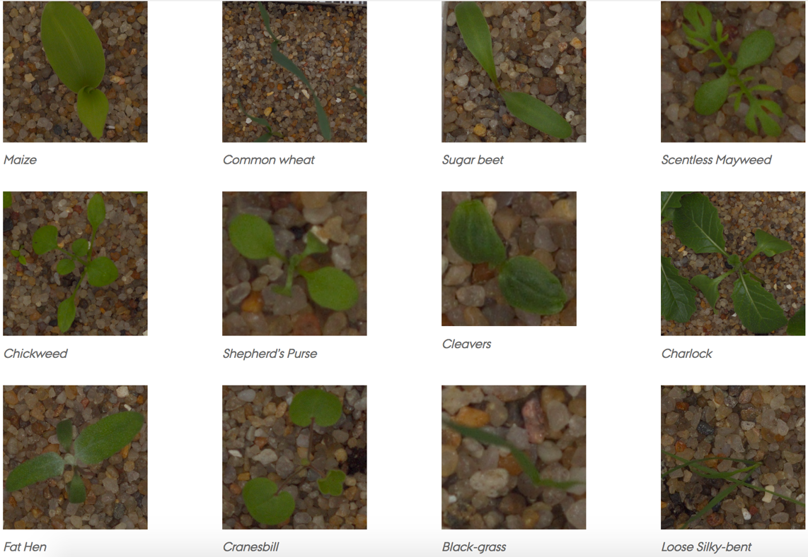

# Plant Seedlings Classification

[Plant Seedlings Classification contest on Kaggle](https://www.kaggle.com/c/plant-seedlings-classification)
Determine the species of a seedling from an image

There are 12 classes in total:


|Author|Student number|
|------|---------|
|邢亚杰|N/A|
|李瑞麟|N/A|
| 王尧 |N/A|

## Collaboration
|file_name|collaborator|
|---------|------------|
|readme.md|王尧|
|basemodel.py|邢亚杰|
|download.sh|李瑞麟|
|model.py|邢亚杰|
|PSDataset.py|李瑞麟|
|submission.py|王尧|
|train.py|邢亚杰|
|utils/logger.py|王尧|
|utils/metrics.py|邢亚杰|
|utils/progress_bar.py|邢亚杰|

## Code map

```
$Root
│
│─ readme.md —— This file
│
|─ basemodel.py —— Basemodel definition
│
|─ download.sh —— Dataset download shell script
│
|─ model.py —— Model definition
│
|─ PSDataset.py —— Dataset preprocessor
│   
|─ submission.py —— Contest submission script
│   
|─ train.py —— Training script
│   
└─ utils —— Useful tools
   │
   |─ logger.py —— Log printing and saving tool
   │
   |─ metrics.py —— Statistic tool
   │
   └─ progress_bar.py —— Progress bar printing tool
```

## Result


